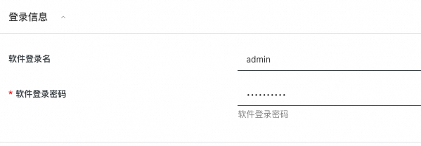
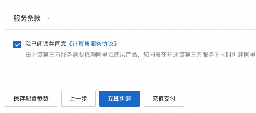

通义千问是由阿里巴巴集团旗下的阿里云开发的聊天机器人，能够与人交互、回答问题及协作创作。 

deepgpu-llm是阿里云GPU云服务器专属的LLM加速套件，能够高效榨取GPU算力，提升LLM模型推理性能。阿里云客户可以免费获取和使用。

本文介绍如何基于计算巢快速构建基于DeepGPU-LLM加速的qwen-7b和qwen-14b对话机器人。

# 1 搭建流程
## 1.1 找到计算巢入口

在阿里云官网搜索“计算巢服务”，进入管理控制台，点击“服务市场”并搜索“qwen”找到服务入口（见下图）。

也可以点击下面链接直接进入服务。

[https://computenest.console.aliyun.com/service/instance/create/cn-hangzhou?type=user&ServiceId=service-9e61243b7c2545e59b4b&ServiceVersion=1](https://computenest.console.aliyun.com/service/instance/create/cn-hangzhou?type=user&ServiceId=service-9e61243b7c2545e59b4b&ServiceVersion=1)

## 1.2 选择部署地域

确保有机器，如果没有机器可以更换地域。

## 1.3 选择实例

## 1.4 设置机器ssh登陆密码

## 1.5 设置webui登陆密码

## 1.6 配置可用区

## 1.7 配置网络

选择新建VPC，默认即可，无需配置。

如果已有VPC（VPC数量会有限制，无法无限创建），就无需新建VPC，可以直接选择已有VPC。

## 1.8 选择模型和精度

总共3个选项：qwen-14b-int8、qwen-7b-float16和qwen-7b-int8，根据需求选择，选择后将自动部署对应的模型和精度。qwen-14b-float16由于所需显存空间较大，无法在单卡机器上部署，暂未提供。

## 1.9 点击“下一步：确认订单”

系统会自动校验上述参数配置，校验通过后点击下一步。

## 1.10 勾选条款并点击“立即创建”

## 1.11 等待服务部署完成

大概需要5分钟～10分钟左右。

# 2 如何使用

部署完成后，就可以打开webui进行对话了。

## 2.1 打开实例，找到webui入口，点击进入

## 2.2 输入账号密码

参见1.5节设置的账号密码

## 2.3 等待模型初始化

LLM模型文件较大，模型初始化需要一定时间，请耐心等待。刷新查看是否初始化完成，若初始化完成，下方红框部分会有具体模型名称显示。

## 2.4 输入对话内容，进行对话体验

初始化完成后，就可以进行对话了。

